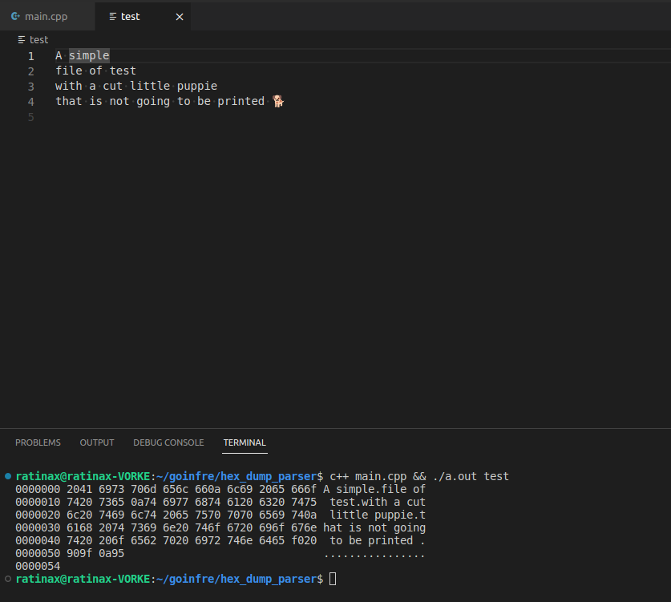

# Ft_transcendence

<!-- TABLE OF CONTENTS -->

  
Table of Contents

  <ol>
    <li>
      <a href="#about-the-project">About The Project</a>
      <ul>
        <li><a href="#built-with">Built With</a></li>
      </ul>
    </li>
    <li><a href="#Execution">Execution</a></li>
  </ol>

<!-- ABOUT THE PROJECT -->
## About The Project

This is a C / C++ project. The aim is to print the hexdump memory as caracteres.

(<a href="#readme-top">back to top</a>)

### Built With

(<a href="#readme-top">back to top</a>)

## Execution

* Here is an example of the execution on a test file

(<a href="#readme-top">back to top</a>)

